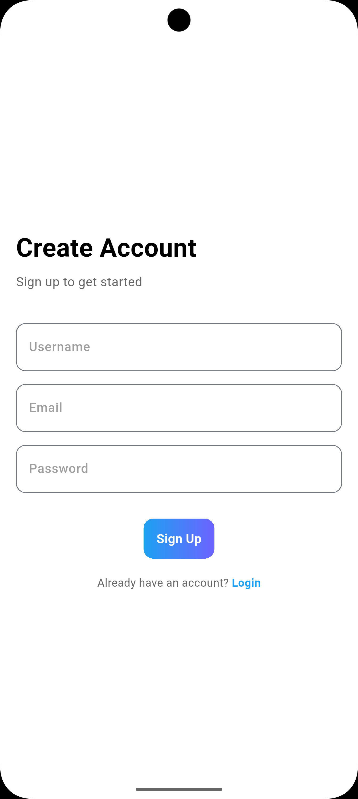
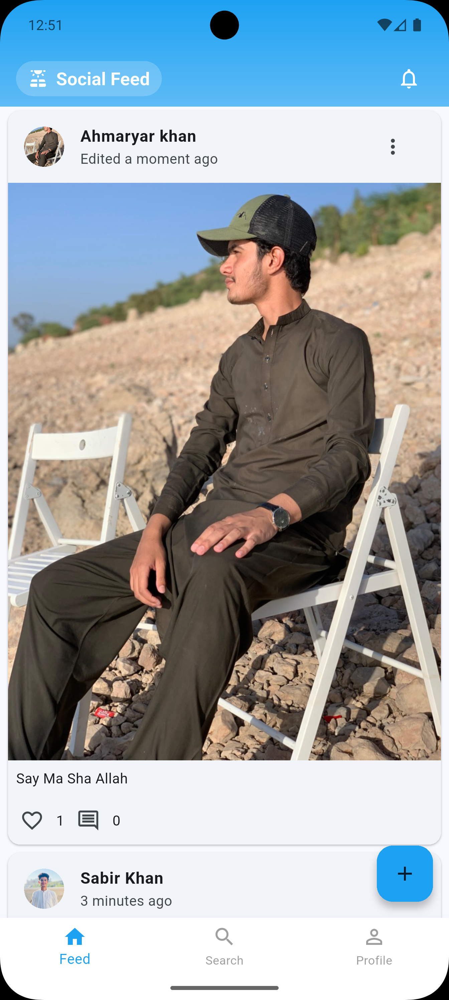
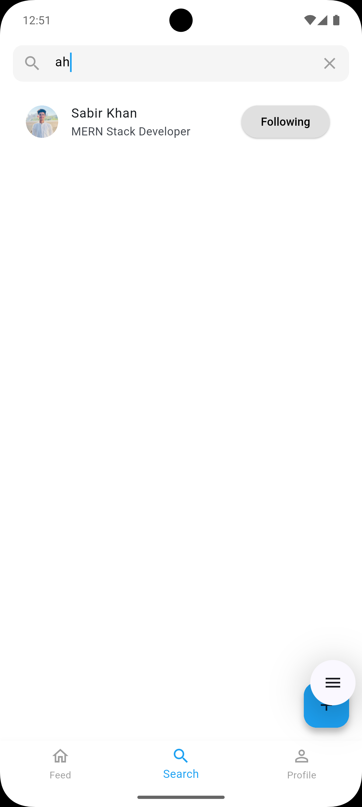

# Social Media App 📱💬

A **basic social media application** built with **Flutter** and **Firebase**, created as part of an internship project.  
Users can **create accounts, post content, like and comment on posts, and follow/unfollow other users**.  

---

## 🌟 Features

- 🔐 **User Authentication**
  - Email & Password Sign up/Login
  - Persistent login state
- 👤 **Profile Management**
  - Customizable user profiles
  - Profile picture upload
  - Update bio
- 🔍 **Social Features**
  - User search functionality
  - Follow/Unfollow users
  - Like and comment on posts
  - Real-time feed updates
- 📱 **Responsive Design**
  - Works across multiple screen sizes
  - Implements Material Design 3

---

## 📸 Screenshots

<div style="display: flex; justify-content: space-between;">
    
    
    
</div>

---

## 🛠️ Tech Stack

- **Frontend**: Flutter  
- **Backend**: Firebase
  - Authentication
  - Cloud Firestore
  - Storage
- **State Management**: Provider  
- **Other Libraries**:
  - cached_network_image
  - image_picker
  - shared_preferences
  - uuid

---

## 🚀 Setup Instructions

### 1. Prerequisites
- Flutter SDK  
- Firebase account  
- Android Studio / VS Code  

### 2. Installation
```bash
# Clone the repository
git clone https://github.com/codexahmar/InternIntelligence_SocialMediaApp

# Install dependencies
flutter pub get
